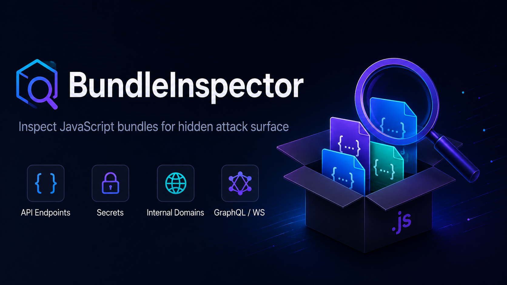

<div align="center">



# 🔎 BundleInspector

### Surface the attack surface hiding in JavaScript.

A static **+** dynamic security scanner that pulls hidden API endpoints, hardcoded secrets,
internal domains, and client-side bypass surface out of JavaScript bundles —
for pentesters, bug-bounty hunters, and AppSec teams.

[](LICENSE)
[](https://www.python.org/)
[](#)
[](https://playwright.dev/)
[](#-what-it-finds)

**English** · [한국어](README.ko.md) · [📖 User Guide](docs/USER_GUIDE.md)

</div>

---

## ✨ Highlights

- **Two modes** — `scan` a live site (crawl → render → download → analyze) or `analyze` local bundles with **zero network traffic**.
- **Deep static extraction** — hidden REST / GraphQL / WebSocket endpoints (incl. server-side `.do`/`.jsp`/`.php`/`.aspx` paths), ~100 secret types, internal & staging domains, feature flags, debug endpoints, **DOM-XSS / code-injection sinks** (`innerHTML`/`.html()`/`eval`/`document.write` fed a dynamic value), reachability-aware **confirmed/probable dataflow**, and **file-upload surfaces** (incl. bypassable client-side validation) — resolved through template literals, string concatenation, branches, constants, aliases, and practical call flows.
- **Offensive recon built in** — seven enhancements: client-side access-control gating, **dormant/hidden endpoints**, replayable curl/fetch PoCs, IDOR + HTTP method-flip hints, reconstructed SPA route maps, GraphQL/WebSocket surface, and **runtime-observed endpoints** (called at runtime but missed statically).
- **Safe by default** — state-changing requests caused while route/click exploration is active are intercepted, recorded, and blocked by default; per-domain rate limiting with adaptive backoff; SSRF & scope guards; secret masking.
- **Bounded and regression-gated** — required Tree-sitter JS/TS/TSX backends, optional Acorn,
  content-hash dedup, resumable checkpoints, and opt-in remote-scan asset multiprocessing. The
  default and local `analyze` paths are serial.
- **Reports that fit your workflow** — JSON, a self-contained HTML report, and **SARIF** for GitHub Code Scanning — plus fuzzing wordlists and a reconstructed API map.

## 🚀 Install

Requires **Python 3.10-3.13**. Headless scanning needs the Playwright Chromium binary.

```bash
git clone https://github.com/g2hsec/bundleInspector.git
cd bundleInspector
python -m venv .venv
```

Activate the virtualenv, then install:

| Shell | Activate |
|---|---|
| **macOS / Linux (bash/zsh)** | `source .venv/bin/activate` |
| **Windows PowerShell** | `.venv\Scripts\Activate.ps1` |
| **Windows cmd** | `.venv\Scripts\activate.bat` |

```bash
python -m pip install -e .
python -m playwright install chromium
```

On a clean Linux host or container, install the Chromium OS dependencies too:

```bash
python -m playwright install --with-deps chromium
```

> **Windows PowerShell 5.1** has no `&&`, and `source` is a Unix-shell command. Run each line separately. If `Activate.ps1` is blocked ("running scripts is disabled"), run `Set-ExecutionPolicy -Scope Process -ExecutionPolicy Bypass` once in the session first.

## ⚡ Quick Start

```bash
# Scan a live target — always stay in scope
bundleInspector scan https://target.example.com --scope "*.example.com"

# Analyze a local bundle — no network traffic at all
bundleInspector analyze ./dist

# Write a shareable HTML report
bundleInspector scan https://target.example.com -f html -o report.html

# Emit SARIF for CI / GitHub Code Scanning
bundleInspector scan https://target.example.com -f sarif -o findings.sarif

# Resume a long scan by job id
bundleInspector scan https://target.example.com --job-id acme --resume
```

## MCP Server

Install the optional MCP dependencies from the source checkout. First create a persisted report,
then configure your MCP client to launch the stdio server:

```bash
python -m pip install -e ".[mcp]"
bundleInspector analyze ./dist --job-id mcp-example
bundleInspector-mcp
```

Omit `--cache-dir` to share the CLI default, `~/.bundleInspector/cache`. If a scan uses a custom
or fallback cache, pass that **exact same cache root** to the server. A mismatched directory produces
an empty job list rather than discovering jobs elsewhere.

The local, stdio-only server exposes three read-only tools: `list_jobs`, `get_job_status`, and
`get_report_page`. Report pages are `findings`, `assets`, `correlations`, or `clusters`.
It also exposes the `bundleinspector://jobs/{job_id}` status resource template with
`application/json` MIME. Only opaque IDs returned by the server are accepted. The server cannot
scan, cancel, write reports, control the network, or return raw artifacts/config/snippets. Its
standalone status is derived from persisted reports, not a live in-process scan queue.

Only jobs owned by the built-in local principal are visible; ownerless legacy cache entries are not
adopted automatically. Read-only describes the MCP capabilities, not zero filesystem writes: first
initialization may create the cache, `.public-view-key`, and a lock shard.

This transport has no protocol authentication and is intended for a client-launched local process,
not a network bridge. Public pages use an explicit allowlist, revision-bound pagination, and
secret/URI redaction, but the cache remains a private OS-level trust boundary. See the
[MCP operations guide](docs/USER_GUIDE.md#mcp-server) and
[storage contract](docs/CONFIG_REFERENCE.md#persistent-storage-and-mcp-contract).

## Verified Current State

| Contract | Current evidence |
|---|---|
| Runtime | Python 3.10-3.13; current source and installed-artifact checks pass on Windows and Linux |
| Detection | Public corpus: 45 cases / 1,916 labels; visible frozen governance: 11 cases / 2,193 labels; both pass all 19 release gates with no labeled FP/FN |
| Coverage | Combined line + branch coverage is 81.72% against an enforced 80% gate |
| MCP | Final wheel real-stdio smoke passes on Windows and Linux with the three-tool/read-only projection |
| Performance | Deterministic 30-run p95/RSS/semantic regression gates are committed for parser, regex, lexical recovery, and correlator scenarios |

The frozen governance set is repository-visible and shares a vendor family; it is not an unseen,
external, statistically independent benchmark. The performance snapshots are the first comparable
current-reference baselines, so they establish reproducibility and future regression limits, **not
a before/after speedup percentage**. See [Performance](docs/USER_GUIDE.md#performance) and
[Frozen Detection Governance](docs/HELDOUT_GOVERNANCE.md).

## 🛡️ Safety First

BundleInspector is a recon tool, not a DoS tool — and the defaults reflect that:

- **Interactive clicking is OFF by default.** The crawler won't click buttons/tabs that could submit forms or trigger deletes.
- **Exploration-induced state changes are blocked by default.** While route/click exploration is active, `POST`/`PUT`/`PATCH`/`DELETE` requests are intercepted, **recorded**, and **not sent** unless an explicitly configured low-level collector callback approves them.
- **Throttled & scoped.** Per-domain rate limiting (default `1 req/s`) with `429`/`5xx` backoff, SSRF protection, and strict scope patterns.

Initial page-load requests are not covered by the exploration guard, and method-based interception
does not recognize a semantically mutating `GET`. The guard can also be disabled or explicitly
approved through a low-level collector callback. Keep interactive clicking off and use a profile
with headless collection disabled when the target requires the narrowest traffic surface.

> **New to a target?** Start with the **`ultra-safe`** or **`conservative`** profile.
> Full details in the [Traffic & Safety guide »](docs/USER_GUIDE.md#-traffic--safety)

## 🎚️ Scan Profiles

Presets in [`examples/scan-profiles/`](examples/scan-profiles/) trade coverage for traffic:

| Profile | Crawl | Headless | Traffic | Use it for |
|---|---|---|---|---|
| `ultra-safe` | 1 page | off | lowest | unknown rules, first contact |
| `conservative` | shallow | off | low | bug-bounty / prod triage |
| `standard` | medium | on | medium | authorized diagnosis |
| `deep` | broad | on + routes | high | SPA-heavy targets |
| `fast` | shallow | off | low | reduced local normalization/source-map work |

```bash
bundleInspector scan https://target.example.com --config examples/scan-profiles/conservative.yml
```

## 🧭 Commands

| Command | What it does |
|---|---|
| `scan <urls…>` | Crawl + analyze one or more **live** targets |
| `analyze <paths…>` | Analyze local files / dirs / globs — **no network** |
| `convert <report>` | Convert a report between JSON ⇄ HTML |
| `version` | Print the version |

Most-used flags: `--config`, `--rules-file`, `-s/--scope`, `-c/--cookie`, `-H/--header`, `-o/--output`, `-f/--format {json,html,sarif}`, `-w/--wordlist`, `--api-map`, `--no-headless`, `--job-id` / `--resume`, `--fail-on {severity}`, `--allow-private-ips`, `--chains`, and `--first-party-only`.
Full reference → [CLI section of the User Guide »](docs/USER_GUIDE.md#-cli-reference)

## 🔬 What It Finds

| Category | Examples |
|---|---|
| **Endpoints** | `fetch`/`axios`/XHR calls, REST · `/graphql` · WebSocket URLs, resolved from templates & constants |
| **Secrets** | ~100 key types (AWS, GCP, Stripe, GitHub, Slack, JWT, private keys) + entropy analysis |
| **Domains** | internal/staging hosts, `.internal`/`.local`, private IPs, S3/GCS/Azure buckets |
| **Feature flags** | LaunchDarkly/Optimizely/Split keywords, `isFeatureEnabled`, admin/debug toggles |
| **Debug** | `/debug` `/admin` `/actuator`, `console.log` of sensitive data, `debugger`, dev-only branches |
| **Sinks & flow** | Dynamic DOM/code/navigation sinks plus confirmed/probable source-to-sink paths |
| **Uploads** | FormData/multipart, JS-built file inputs, client-only file-type validation |
| **Routes & runtime** | Reconstructed client routes, named chunks, dormant and runtime-only endpoints |

Findings are risk-tiered **P0 → P3** (critical → informational) with impact/likelihood scoring.
Reports also carry `complete`, `partial`, `failed`, or `cancelled` analysis completeness and
machine-readable coverage-loss issues. See the
[Detection Coverage guide »](docs/USER_GUIDE.md#-detection-coverage).

## 📚 Documentation

- **[User Guide](docs/USER_GUIDE.md)** — full CLI, configuration, detections, safety deep-dive, performance
- **[Config Reference](docs/CONFIG_REFERENCE.md)** — every configuration field
- **[Custom Rules](docs/CUSTOM_RULES.md)** — write your own regex / AST / semantic rules
- **[Frozen Detection Governance](docs/HELDOUT_GOVERNANCE.md)** — release gate procedure and statistical limits
- **[Implementation Status](docs/IMPLEMENTATION_CHECKLIST.md)** — current shipped capabilities, validation, and explicit limitations

## ⚖️ License & Disclaimer

Released under the **MIT License** — see [LICENSE](LICENSE).

> Only scan systems you **own** or are **explicitly authorized** to test. You are responsible for staying within a target's rules, rate limits, and automation policy. Test fixtures in this repo intentionally contain **fake** secret-like strings so detection and masking can be verified — they are not live credentials.
